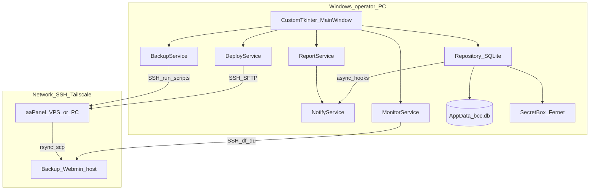

# Architecture

Last aligned with codebase: 2026-08-12 (build 0.1.0-10).

## Application architecture

Desktop process:

## Design principle

**Support & monitor autonomous backup.** Heavy lifting runs on remotes under cron. BCC deploys, schedules, inspects, and records history locally.

## Backend architecture

Not a multi-tier HTTP server. Layers inside `bcc/`:

| Layer | Role |
|-------|------|
| `ui/*_view.py` | Presentation, threads for long ops |
| `services/*` | Domain actions (SSH, deploy, backup, notify, report, browse) |
| `db/repository.py` | Persistence + notify fire-and-forget after CRUD/history |
| `db/schema.py` | DDL seed |
| `paths.py` | Frozen-resource and AppData paths |

## Frontend architecture

- `MainWindow` (sidebar navigation) hosts views: Dashboard, Targets, Sources, Schedules, Files, Monitor, Settings.
- Tables often rebuilt as CTk labels/grids (ttk Treeview avoided on status tables where it was fragile).
- Disk pie: `pie_chart.py` (Pillow) + legend labels.

## Database architecture

- Single SQLite file; see `DATABASE.md`.
- Settings key-value for SMTP/WA/report flags.
- Inventory encrypted password fields.

## Authentication / authorization

- No multi-user app auth.
- Remote access: SSH user/password or key per target/source.
- Local vault key: `%AppData%\BackupControlCenter\.vault_key` (Fernet).

## API

No public REST API. CLI entry: `python -m bcc`. Helper scripts at repo root for onboarding/ops.

## Queue / cache

- `threading.Thread(..., daemon=True)` for SMTP, SSH bulk checks, disk chart, email report.
- No Redis/Celery.

## Storage

| Data | Location |
|------|----------|
| Inventory secrets | SQLite `*_enc` + vault key |
| App logs | `AppData/.../bcc.log` |
| Remote backups | `target.base_path / source_label / ...` on backup host |
| Templates | `bcc/templates/` (bundled in EXE) |

## External services

| Service | Usage |
|---------|--------|
| SMTP SSL (e.g. mail.akenvi.com) | Event notify + daily report |
| WhatsApp gateway (Fonnte-style URL) | Stub until token filled |
| Tailscale | Optional CLI status; preferred for private IPs |
| aaPanel | Cron job push by name when using DeployService |
| Webmin | Open via browser URL per target |

## Deployment

- Operator: Windows EXE or `python -m bcc`.
- Sources: scripts under deploy path default `/www/backup-scripts`.
- Backup host: SSH as configured user; Webmin UI separate (port 10000 default).

## Networking

- Often Tailscale 100.x hosts between operator PC, VPS, and backup server.
- SSH port default 22.

## Monitoring

- Dashboard SSH status columns (`last_ssh_ok`).
- Disk pie: free + per-inventory **label** sizes under backup folders.
- `run_history` timeline + daily report filter `run_type LIKE 'backup%'`.

## Backup (domain)

Remote scripts: `backup-webs.sh`, `backup-dbs.sh`, `backup-all.sh` (+ templates). Retention configured in remote `config.sh` (template placeholders filled at deploy).

## Why this architecture

- Single-operator desktop avoids ops server dependency.
- SQLite + AppData keeps inventory portable per machine without cloud identity.
- Async notify hooks never fail primary CRUD/backup paths.
- Scripts remain portable shell for aaPanel cron independence if GUI is offline.
