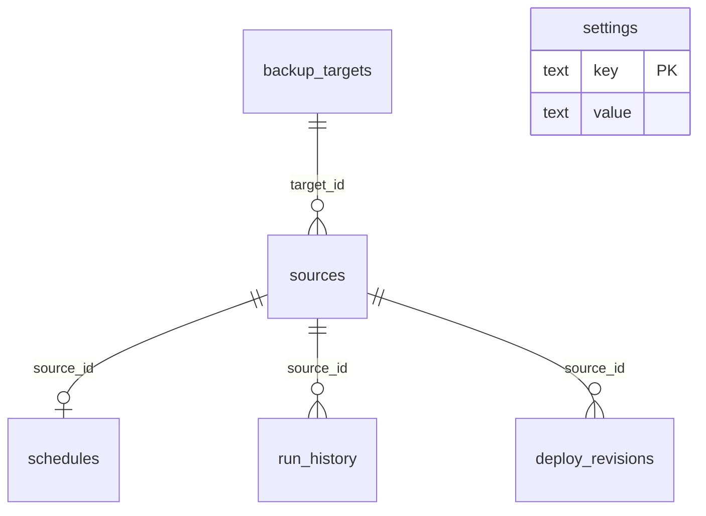

# Database

## Engine

- **SQLite 3** via Python `sqlite3`
- Path: `%AppData%\BackupControlCenter\bcc.db` (Windows) — see `bcc/paths.py` `db_path()`
- Foreign keys: `PRAGMA foreign_keys = ON`
- Row factory: `sqlite3.Row`

## Version / migrations

- Base DDL: `bcc/db/schema.py` → `SCHEMA_SQL` on `Repository.initialize()`
- Idempotent column adds: `Repository._migrate()`  
  Known migrations: `last_ssh_ok`, `last_ssh_at`, `webmin_url` on `backup_targets`
- No Alembic/Flyway; keep migrations additive and safe.

## Tables overview

---

## settings

**Purpose:** Key-value configuration (SMTP, WA, report flags, disk threshold).

| Column | Notes |
|--------|--------|
| key | PRIMARY KEY |
| value | TEXT |

Important keys (non-exhaustive):

| Key | Meaning |
|-----|---------|
| `disk_alert_gb` | Dashboard disk alert threshold |
| `notify_email_enabled` | `1`/`0` |
| `smtp_host`, `smtp_port`, `smtp_user`, `smtp_from` | SMTP |
| `smtp_password_enc` | Encrypted SMTP password |
| `notify_to` | Event notification To |
| `daily_report_enabled` | Auto daily report |
| `daily_report_to` | Default `akenprodev@gmail.com` |
| `report_email_last_day` | `YYYY-MM-DD` last auto-sent |
| `notify_wa_*` | WA stub fields |
| `notify_wa_token_enc` | Encrypted token |

**Do not commit** values that are secrets. AppData only.

---

## backup_targets

**Purpose:** Backup destination servers (e.g. Webmin host).

| Column | Notes |
|--------|--------|
| id | PK |
| label, host, port, username | SSH identity |
| password_enc, key_path | Auth |
| base_path | Backup root (default `/home/backupuser/backups`) |
| webmin_url | Optional; empty → UI uses `https://{host}:10000` |
| notes | Free text |
| last_ssh_ok, last_ssh_at | Probe |
| created_at, updated_at | UTC-style timestamps from `_now()` |
| deleted | Soft delete `0/1` |

**Related modules:** Targets UI, Dashboard, Browse, Deploy, Monitor disk.

---

## sources

**Purpose:** VPS/PC inventory that produce backups.

| Column | Notes |
|--------|--------|
| id | PK |
| label | Human title (shown on pie chart) |
| role | `linux_vps` \| `windows_pc` |
| host, port, username, password_enc, key_path | SSH |
| target_id | FK → backup_targets |
| deploy_path, web_root | Remote paths |
| source_label | Folder name under target base_path |
| mysql_user, mysql_password_enc | DB backup |
| aapanel | 0/1 |
| last_ssh_ok, last_ssh_at, last_deploy_at | Status |
| deleted | Soft delete |

---

## schedules

**Purpose:** Local schedule plan + push to remote cron.

| Column | Notes |
|--------|--------|
| source_id | UNIQUE FK |
| web_hour/minute, db_hour/minute | Local plan |
| enabled, estimated_web_minutes | Stagger planner |

---

## run_history

**Purpose:** Action log for notify + daily report.

| Column | Notes |
|--------|--------|
| source_id | FK |
| run_type | e.g. `backup_all`, `deploy`, `ssh_test`, … |
| status | `ok` / `fail` / … |
| message | Free text |
| recorded_at | String timestamp |

Daily report filters `run_type LIKE 'backup%'` and `recorded_at LIKE 'YYYY-MM-DD%'`.

**Limitation:** Only actions going through BCC repository. Pure remote cron without BCC does not insert rows here.

---

## deploy_revisions

**Purpose:** Track template version / remote hash after deploy.

---

## Indexes / triggers / views

None custom beyond PK/UNIQUE FKs. Keep simple unless performance demands otherwise.

## Multi-tenant

None — single operator machine DB.

## Backup strategy (of BCC data)

- User responsibility: AppData folder backup
- Repo does not backup AppData
- Rebuild EXE does not migrate DB schema destructively

## Secret storage (related)

- Fernet key: `app_data_dir() / ".vault_key"`
- Encryption API: `bcc/services/secrets.py` `SecretBox`

## Storage lifecycle tables

- `backup_storages`: registered remote storage/mount paths linked to `backup_targets`; soft-deleted with `deleted=1`.
- `retention_jobs`: one policy per storage, default retention `3` days, action mode, archive storage, and scan interval.
- `retention_items`: discovered old files, grouped by `group_key`, with `pending`, `archived`, `deleted`, or `error` status.

Scans upsert pending candidates by `(storage_id, path)`. Existing acted items are not reverted to pending by a later scan. Existing AppData databases receive these tables through idempotent initialization.
The archive group fallback is `arsip`; initialization migrates the older ambiguous `default` value to `arsip`.
